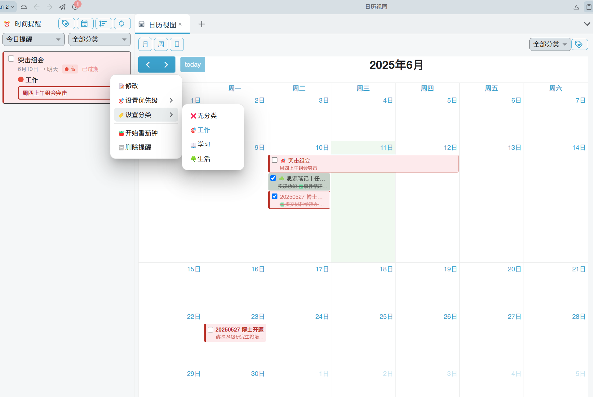

## 插件简介

一款任务笔记时间提醒插件，用于践行防弹笔记法而开发，支持文档和块提醒、日历视图查看行事历、番茄钟专注等功能

> 前排提醒，插件为个人自用，对任何因为插件导致的数据丢失问题概不负责
> 请考虑清楚再使用。

### 什么是防弹笔记法

想要了解防弹笔记法的朋友可以阅读[《大脑减压的子弹笔记法 》](https://book.douban.com/subject/35115765/)和[《防弹笔记法》](https://book.douban.com/subject/36289807/)

简单介绍下防弹笔记法：

「绝大数人不需要整理资料，需要的是整理任务。」

许多知识管理书籍和博客提倡打造“第二大脑”，但这一概念不应被简单理解为建立一个资料库。如果我们在构建第二大脑时，仅仅以整理资料为目标，就容易陷入为了分类而分类的误区。这种情况下，我们可能会花费大量时间对资料进行细致的分类和结构化处理，但这些工作却与我们的实际目标或任务推进毫无关联。

真正的“第二大脑”并不是一个单纯的资料存储系统，而是一个能够指引行动的实践工具。

防弹笔记法，简单来说就是，从为了避免遗忘记录资料笔记，变成以任务为中心、记录「核心任务笔记」。
这种方法强调的是将笔记作为行动的工具，而不是单纯的知识存储。它鼓励我们将注意力集中在实际的任务和行动上，而不是过度关注资料的整理和分类。

笔记不应该是为了复制和存储，而是为了创造，是为了帮助自己把万事万物变成「想要的样子」。

### 为什么不用滴答清单等待办软件进行任务管理

防弹笔记法推荐不用待办清单软件，而直接用笔记软件进行任务管理，打造一个可以支援自己的任务笔记系统。

因为这类工具背后没有支援系统，列出的每日行动清单，容易没有经过仔细思考和规划。一堆杂事只是从混乱的大脑中，原封不动地移到清单上，依然是混乱的状态。于是我们在面对待办清单时，依然感觉充满压力，感到混乱和焦虑。

还有一个最重要的原因，那就是任务完成后就被会划掉！也许你会说，这样不是很有成就感吗？如果一个任务做完后它就结束了，那意味着这个任务不重要，或是无法延伸出更多的价值。这些软件的笔记和任务管理功能，往往是为了方便快速记录和完成任务，但它们并没有提供一个系统化的方式来持续跟踪和完善这些任务，没有把这些任务和项目当成个人珍宝，永久保留下来。

而用笔记软件搭建任务管理系统的好处是，可以不断完善项目笔记和任务笔记，随着时间积累和实践，项目笔记和任务笔记会记录满满我们的劳动成果和智慧结晶。哪怕项目已经归档了，将来哪天需要，可以很方便调用出来这样，这些笔记才会成为自己的经验宝库，这样才能让价值不断延伸，帮助自己不断成长，不断进步，越做越好。

### 防弹笔记法创建笔记的核心原则

1. **一个任务，一条笔记，以任务为中心**：笔记的核心是任务，而不是资料。每个笔记都应围绕一个具体的任务展开。每个笔记都应包含明确的行动步骤。
2. **持续迭代**：笔记应随着时间和实践不断完善，成为个人知识和经验的积累。
3. **整体视角**：笔记应从整体上把握任务和项目，避免碎片化和孤立化。
4. **搭建项目主页，善用链接**：将项目需要的所有资料、相关笔记、任务计划与实际任务进展等都链接到项目主页上，形成一个完整的项目主页。

### 运行防弹笔记法进行时间管理和任务管理的重要理念

1. 时间管理和任务管理真正需要整理的是什么
   1. 选择什么是重要的。
   2. 选择我现在应该如何行动。
2. 时间管理和任务管理的核心目标是把想做的事情都做完吗？
   1. 时间管理的核心目标，不是把所有事情都做完，因为本质上我们不可能把所有事情都做完，我们想做、要做的事情永远多于我们可以支配的时间。
   2. 所以我们必须做出选择，选择不是随心所欲的，而是依赖系统，通过行动的关联、任务的拆解、项目的整合，让我们明确最佳的行动是什么。
3. 搭建任务管理系统的正确流程是什么

   - 我们不应该埋首于一大堆杂乱的事情中苦干，这样虽然可能解决一些问题，但会花费许多时间、精力，甚至有可能走错方向，最后却一事无成，感觉自己在瞎忙。
   - 以下顺序非常重要：

     - 第一步，先设定好自己想达成的目标。
     - 第二步，根据目标，设定我们需要的功能，或是需要完成哪些阶段性任务。
     - 第三步，开始安排我们的行动，逐步实现这些功能、目标。
4. 如何搭建不遗漏事项的时间管理和任务管理系统？
   1. 时间提醒
   2. 但仅仅靠时间提醒，也会因为没看到、事项变动而遗忘。另一个技巧是，把行动、任务放在我需要时一定会经过的地方，通常就是项目里的某个位置。当我需要时一定会经过，一定会看到它，进而采取行动。就可以把相关的任务按照行动顺序放在项目笔记里，这样执行这个项目的时候，就可以知道自己下一步要做什么。

## 插件主要功能

- **提醒设置**：支持为文档或块设置时间提醒，包含重复提醒功能。
- **分类管理**：为提醒添加分类，方便组织和筛选。
- **优先级设置**：支持高、中、低及无优先级设置。
- **番茄钟管理**：记录工作时长、休息时长及长休息时长，支持背景音设置。
- **日历视图**：提供直观的日历视图，方便查看和管理提醒。
- **批量设置提醒**：支持为多个块同时设置提醒。
- **徽章提醒**：在顶栏和停靠栏显示未完成提醒数量。
- **通知功能**：到达提醒时间时自动弹出通知。

## 使用说明

### 设置提醒

1. 在文档或块菜单中点击“⏰”设置时间提醒，对于文档块，文档面包屑也会添加便捷的“⏰”提醒按钮。
2. 选择提醒日期、时间、优先级、分类等信息。
3. 点击确认保存提醒。
4. 在创建提醒时给对块添加“⏰”书签，在完成/删除提醒后检查该块是否还有未完成的提醒，如果没有则移除书签

### 查看日历视图

1. 点击插件顶栏按钮或停靠栏图标。
2. 在弹出的日历视图中查看和管理提醒。

### 番茄钟设置

1. 在插件设置中配置工作时长、休息时长及背景音。
   - **番茄钟工作时长**：默认 25 分钟。
   - **番茄钟短时休息时长**：默认 5 分钟。
   - **番茄钟长时休息时长**：默认 30 分钟。
   - **背景音设置**：支持工作、休息及结束提示音。
2. 启动番茄钟后，插件会自动记录工作和休息时间。
3. 双击可以修改当前番茄钟的工作时长或休息时长。

## 联系

如有问题或建议，请通过 GitHub 提交 Issue。

